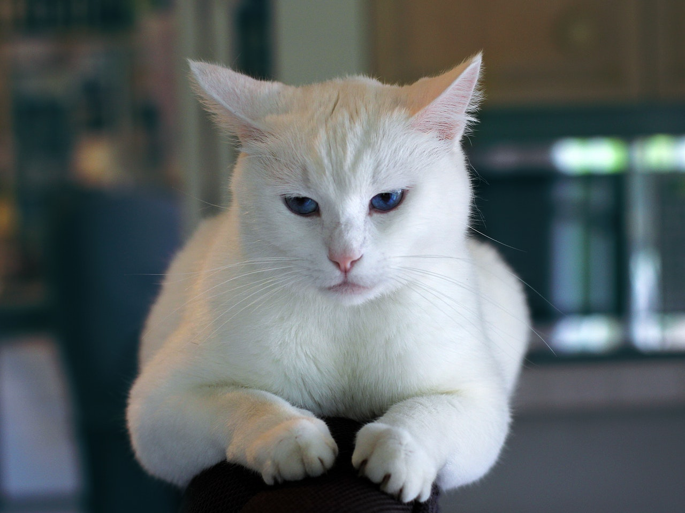
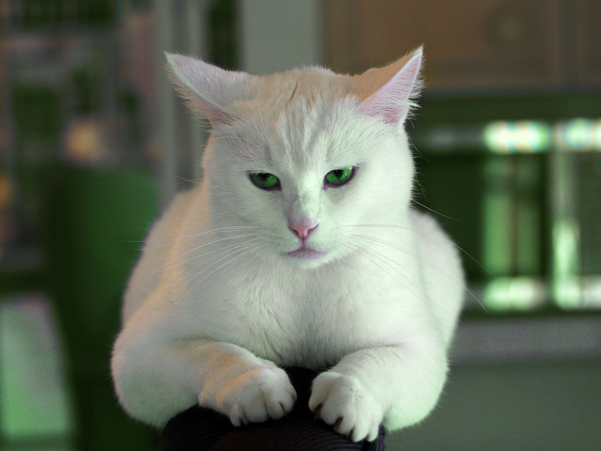

# [](#header-1)Background Story

Many people agree that cat is a cute animal. Look at this picture.

Taken from [https://www.pexels.com/photo/animal-kitten-cat-pet-7517/](pexels)



Despite the cuteness, not everybody feels comfortable with blue color. Some people prefur green, as depicted in the following picture.



This project demonstrates how to use OpenCV to help us enjoying the cuteness of a cat while maintaining our favorite color

# [](#header-1)How the code works

## [](#header-2)Formula

Let's take a simple example of grayscale image. Given a grayscale image with intensity 0-255, we want to convert all pixels with intensity 50-100 to 125-150. Simple math will allows us to do it. Let's formulate:

```
initial_intensity_min = 50

initial_intensity_max = 100

target_intensity_min = 125

target_intensity_max = 150
```

Let's define

```
initial_length = initial_intensity_max - initial_intensity_min

target_length = target_intensity_max - target_intensity_min
```

The new image can be obtained started with masking the image to obtain the region of interest (we remove all the pixels with intensity outside 50-100 range). Let's denote this as Masked_Image. Let's call the image whith excluding the pixels within Masked_Image as Non_Region_Image. 

Then we process the image as the following:

```
Processed_Image = target_intensity_min + ((Masked_Image - initial_intensity_min) / (initial_length)) * (target_lenth)
```

The final image can be obtained by combining by adding the Processed_Image with the pixels outside the region of interest.

```
Final_Image = Non_Region_Image + Processed_Image
```

That's all we do to map intensity on grayscale image. Intuitively for color image we could do the same process for each channel.

## [](#header-2)Explanation

The code consists of two functions as defined in the header file. 



#pragma once

#include <iostream>
#include <opencv2\core\core.hpp>
#include <opencv2\imgproc\imgproc.hpp>
#include <opencv2\highgui\highgui.hpp>

using namespace std;
using namespace cv;

void mapIntensity(InputArray src, OutputArray dst, Range initialIntensity, Range targetIntensity);

void mapIntensity(InputArray src, OutputArray dst, vector<Range> initialIntensities, vector<Range> targetIntensities);



The first ```mapIntensity``` function deals with one channel image. The second one deals with multichannel image.

The first function is implemented by the following steps.

1. Making sure that the number of channel is only one.
1. By default the image format usually unsigned int. The image is converted into 32 bit floating point format to enable floating point and negative result of operation.
1. Map the region of interest.
1. Convert back image to unsigned in format.
1. Get the image outside region of interest.
1. Combine the images.
1. Set the output.

The function for one channel is shown in the following.


/// Function to map between two ranges of intensity.  The initial intensity will be mapped
/// to the target intensity. This function assumes that the input only has one channel.
void mapIntensity(InputArray src, OutputArray dst, Range initialIntensity, Range targetIntensity)
{
	if (src.getMat().channels() > 1) {
		throw invalid_argument("number of channel > 1");
		return;
	}

	/// Convert Mat to float to enable floating point and negative value
	Mat srcMat;
	src.getMat().convertTo(srcMat, CV_32F);
	/// Specify the region which satisfies the initial intensity criteria
	Mat region;
	inRange(srcMat, initialIntensity.start, initialIntensity.end, region);

	/// Compute the mapped intensity given the region of interest
	/// initial_length = initial_intensity_max - initial_intensity_min
	/// target_length = target_intensity_max - target_intensity_min
	/// Processed_Image = target_intensity_min + ((Masked_Image - initial_intensity_min) / (initial_length)) * (target_lenth)
	Mat resultTemp(srcMat.rows, srcMat.cols, srcMat.type());
	subtract(srcMat, (float)initialIntensity.start, resultTemp, region);
	divide(resultTemp, (float)(initialIntensity.end - initialIntensity.start), resultTemp);
	multiply(resultTemp, (float)(targetIntensity.end - targetIntensity.start), resultTemp);
	add(resultTemp, targetIntensity.start, resultTemp, region);

	/// Convert to the default format back to enable displaying
	resultTemp.convertTo(resultTemp, CV_8U);

	/// Now add the non-region of interest with the region with mapped intensity 
	Mat inverseRegion;
	bitwise_not(region, inverseRegion);
	Mat excluded;
	srcMat.copyTo(excluded, inverseRegion);
	excluded.convertTo(excluded, CV_8U);

	Mat result;
	add(excluded, resultTemp, result);

	/// Set the output value
	dst.assign(result);
}


The function for multi-channel is shown in the following. It is implemented as using single channel ```mapIntensity``` for each image channel.


/// Function to map between two ranges of intensities. 
/// This function can handle multichannel.
void mapIntensity(InputArray src, OutputArray dst, vector<Range> initialIntensities, vector<Range> targetIntensities)
{
	Mat srcMat = src.getMat();
	
	/// Check if the number of intensities to be mapped conforms the number of image channels
	if ((initialIntensities.size() != srcMat.channels()) && (targetIntensities.size() != srcMat.channels())) {
		throw invalid_argument("the number of channel doesn't match the number intensity range");
		return;
	}
	
	/// Split each channel
	vector<Mat> channels;
	split(srcMat, channels);

	/// Map each channel
	for (int i = 0; i < channels.size(); i++) {
		mapIntensity(channels[i], channels[i], 
			Range(initialIntensities[i].start, initialIntensities[i].end), 
			Range(targetIntensities[i].start, targetIntensities[i].end));
	}

	/// Combine back
	Mat result;
	merge(channels, result);

	/// Set the output value
	dst.assign(result);
}


# [](#header-1)Usage 

## [](#header-2)Grayscale

```cpp
	Mat img = imread("animal-sitting-animals-inside.jpg", IMREAD_COLOR);

	if (img.empty())
	{
		cout << "Can not load image" << endl;
	}

	Mat srcGray; 
	Mat dstGray;
	cvtColor(img, srcGray, COLOR_BGR2GRAY);

	mapIntensity(srcGray, dstGray, Range(0, 255), Range(255, 0));
```

## [](#header-2)HSV Color Image

```cpp
	Mat img = imread("animal-sitting-animals-inside.jpg", IMREAD_COLOR);

	if (img.empty())
	{
		cout << "Can not load image" << endl;
	}

	/// HSV intensity mapping

	/// hsv initial range
	vector<Range> initial;
	initial.push_back(Range(80, 120)); // hue
	initial.push_back(Range(0, 255)); // saturation
	initial.push_back(Range(0, 255)); // value
	/// hsv target range
	vector<Range> target;
	target.push_back(Range(35, 70)); // hue
	target.push_back(Range(0, 255)); // saturation
	target.push_back(Range(0, 255)); // value

	Mat hsvMapped;
	cvtColor(img, hsvMapped, COLOR_BGR2HSV);
	mapIntensity(hsvMapped, hsvMapped, initial, target);
	cvtColor(hsvMapped, hsvMapped, COLOR_HSV2BGR);

	display("Mapped - Color", hsvMapped);
```
